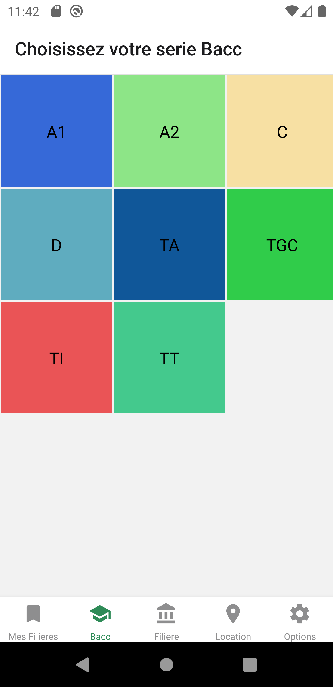
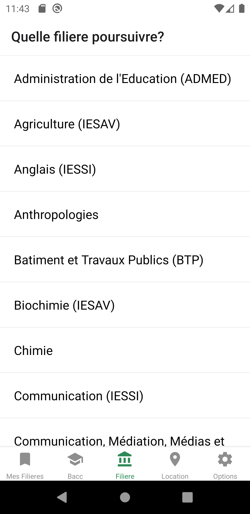
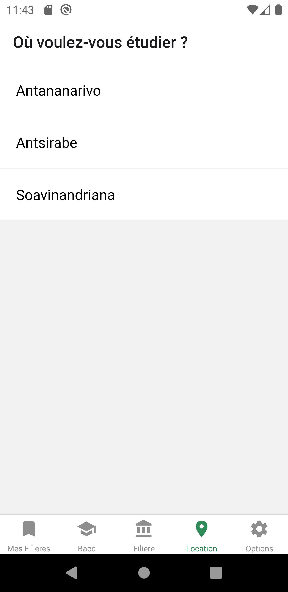
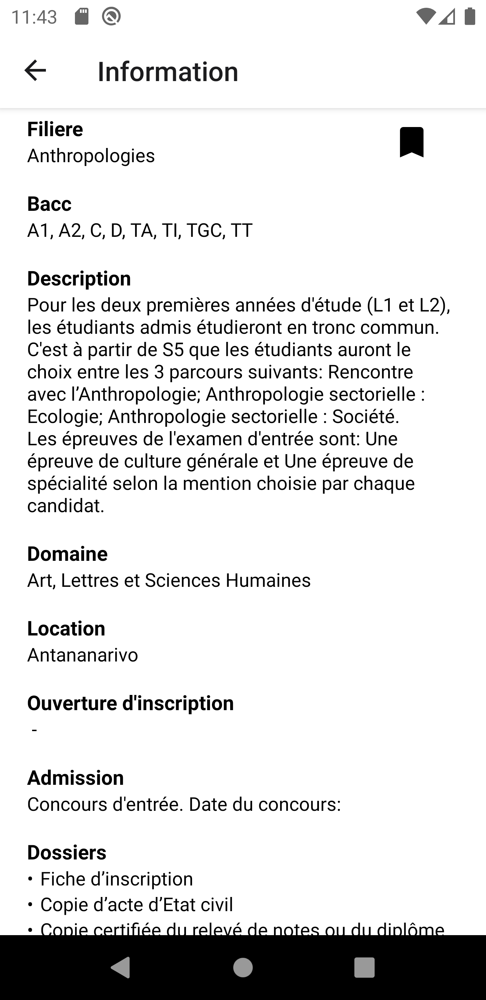
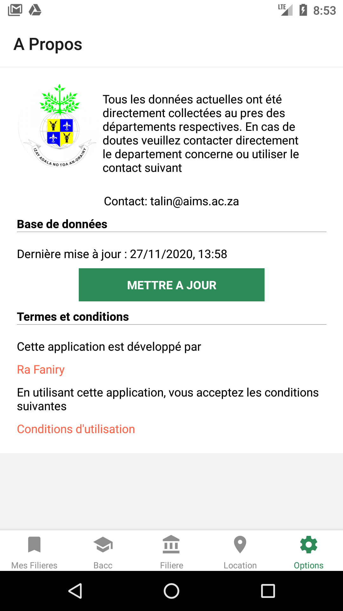

# Torolalana

Cross-platform app for Android and iOS written with React Native to help Malagasy student.

[](https://www.gnu.org/licenses/gpl-3.0)

<p style="display: flex;flex-wrap: wrap; align-items: center;justify-content: center">
  <a href="https://play.google.com/store/apps/details?id=com.torolalana">
    
  </a>
</p>

# :camera: Screenshots

<p float="left">
  
  
  
  
  
</p>

## :hammer: Try it yourself

### 1. Clone and Install

```bash
# clone the repo
git clone https://github.com/faniry6/Torolalana.git

# Open the folder and install dependencies
cd Torolalana && npm install
```

### 2. Run it on both iOS and Android

```bash
# Run on iOS
npm run build:ios

# Run on Android
npm run build:android
```

### Or use Docker (for Android)

```bash
# Build the container and run the build scripts inside it
docker-compose run --service-ports android bash
```

Obs: The docker container can't attatch to the device via USB. You have to build the app-debug.apk using `npm run build:android`, copy the generated file inside `./android/app/build/outputs/apk/debug/app-debug.apk` and install it manually on the device.

## Built With

- [React Native v0.60](https://facebook.github.io/react-native/) - The framework for building native apps using React
- [Realm v3.0](https://github.com/realm/realm-js) - Realm is a mobile database that runs directly inside phones, tablets or wearables
- [React Navigation v4.0](https://reactnavigation.org) - React Native module support navigation
- [React Native Vector Icons v6.6](https://github.com/oblador/react-native-vector-icons) - Customizable Icons for React Native with support for NavBar/TabBar/ToolbarAndroid, image source and full styling
- [React Native Webview](https://github.com/react-native-community/react-native-webview) - A modern, well-supported, and cross-platform WebView for React Native

## :raising_hand: How can you help

If you find any problems, feature requests, please open an issue or submit a fix as a pull request.

## :newspaper: License

[GNU General Public License v3.0](LICENSE)

## Credits

Developed by [Ra Faniry](https://github.com/faniry6).
